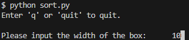

# Sort-Example
Hello welcome to an example script to sort boxes based on width, height, length, and mass.

## Instructions
The instructions are as shown below.

1. Run the below in a termianl that includes python.
    ```shellscript
    python sort.py
    ```
2. The below should be the output

    

3. Input the information based on the information presented on the screen.

    

4. Once inputs are all entered correctly, the script will respond with the appropriate package stack placement

    
    
5. Enjoy the sort example!